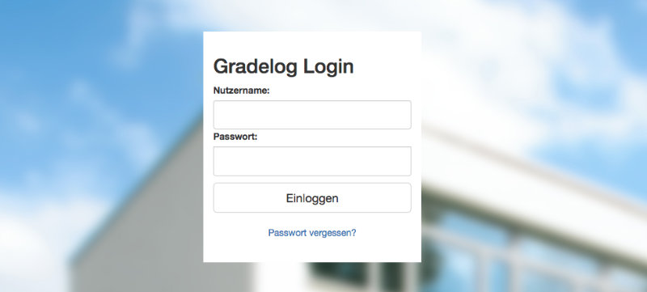
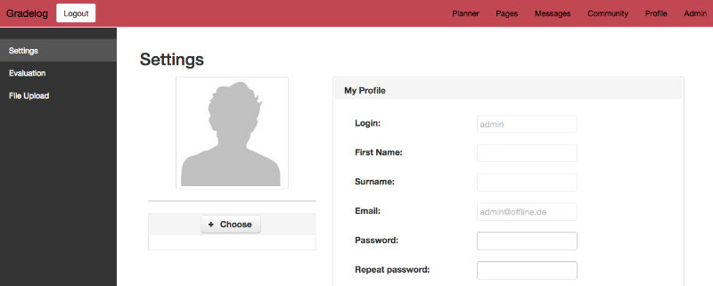

# Gradelog

**Gradelog** is a [JSF](https://javaee.github.io/javaserverfaces-spec/)-based web app that provides all [features](#dart-features) needed to **organize** and **plan** a **school operation**.


## :dart: Features

* Calendar with reminders
* Dynamic dashboard
* Messaging system
* Plans like a substitution schedule with CSV imports
* Users and groups
* And much more

## :rocket: Getting Started

### :wrench: Installation

Open your terminal and go to the root directory of this cloned repository. Afterwards, type the command `mvn package`. Then the WAR file is located in the created directory *target*.

The next step is about installing [GlassFish](https://glassfish.org), which must be downloaded and unzipped. Now go into the *bin* directory.

#### Windows

Run *asadmin.bat* and type `start-domain` as well as `start-database`.

#### Linux and macOS

Type the following commands:

```console
$ ./asadmin start-domain
$ ./asadmin start-database
```

If you want to stop the server, just type:

```console
$ ./asadmin stop-domain
$ ./asadmin stop-database
```

The server is now available at [http://localhost:4848](http://localhost:4848).

To install Gradelog, the following final steps are necessary:

1. Click *Applications* on the left sidebar.
3. Click *Deploy*.
4. Click *Choose File* at *Packaged File to Be Uploaded to the server*.
5. Select the WAR file.
6. Look for *Context Root* where you can edit the root, i.e. if you change it to *gradelog*, the homepage will be available at [http://localhost:8080/gradelog](http://localhost:8080/gradelog).
7. Confirm with *Ok*.

### :computer: Usage

If the app is successfully installed, the following [login page](http://localhost:8080/scheduler) should be accessible:



By default, the first login is via the username *admin* and password *Test123#*. The Gradelog interface will then be shown.

## :eyes: Examples

### :large_orange_diamond: Changing Language



To change the language, first go to *Profil*. Scroll down to the *Sprache* label. Now use the drop-down menu to set a desired language such as *Englisch*.

### :large_orange_diamond: Changing Password

To change the password, scroll to the *Password* label. Now enter the new password and confirm it by clicking the button labeled *Save*.

## :white_check_mark: Tests

To run the unit tests, the command `mvn package` is sufficient.

The test coverage can be viewed using `cobertura:cobertura && mvn site`.

## :book: Documentation

The Gradelog documentation becomes available by typing `mvn javadoc:javadoc` in the terminal.

## :warning: License

Gradelog is licensed under the terms of the [MIT license](LICENSE.txt).

## :trophy: Award

Gradelog was honored as the **Best Project** of the student course _Software-Projekt 2_ at University of Bremen in 2017. It was developed according to [Oberschule Ronzelenstrasse](https://ronzelen.schule.bremen.de) requirements.
